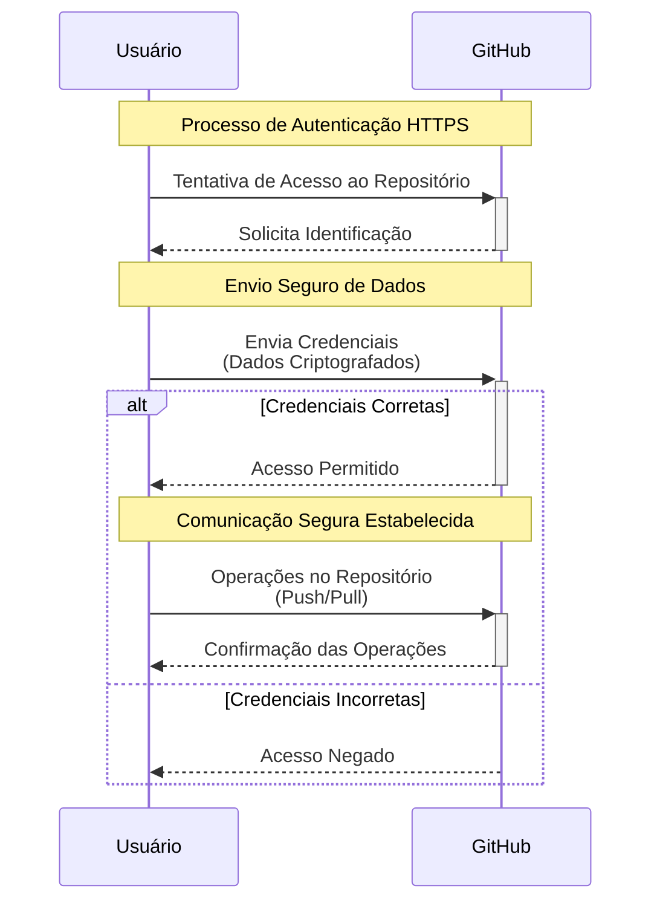

<!-- Título -->
# Utilizando HTTPS Para Comunicação

***Conteúdo da Aula:***

## :memo: Explicação do Processo

Imagine que você quer enviar uma carta secreta para seu amigo que mora muito longe. Você precisa garantir que só ele vai conseguir ler o que está dentro da carta, certo? É exatamente assim que funciona o HTTPS quando estamos trabalhando com o GitHub!

### Vocabulário Básico:

- `Protocolo` &#8594; Uma espécie de "regra do jogo" que define como as coisas devem funcionar.
- `Segurança` &#8594; Medidas para proteger informações importantes.
- `Repositório` &#8594; Um lugar onde guardamos nossos arquivos no GitHub.

### Como Funciona (Passo a Passo):

**Quando você quer acessar um projeto no GitHub**:

- É como tentar entrar em uma casa segura.
- O GitHub verifica quem você é.
- Se tudo estiver ok, você consegue entrar.

**Durante a comunicação**:

- Todas as mensagens são criptografadas (como um código secreto).
- Ninguém consegue ler o que está sendo enviado.
- Só quem tem a chave certa pode descriptografar.

### Entendendo o Diagrama:

- As setas azuis mostram as mensagens enviadas entre você e o GitHub.
- Quando vê "Credenciais", pense em sua senha ou token de acesso.
- As operações no repositório são coisas como salvar ou baixar projetos.
- O "alt" mostra dois caminhos possíveis: sucesso ou falha no acesso.

### Por Que É Útil?

O HTTPS é como ter um guarda-costas especial para seus projetos no GitHub. Aqui estão algumas vantagens importantes:

- **Proteção Total**:

- Seus arquivos ficam seguros durante todo o caminho até o GitHub.
- Ninguém pode interceptar ou modificar seus projetos.
- É como enviar uma carta em um envelope mágico que só pode ser aberto pelo destinatário.

- **Facilidade de Uso**:

- Não precisa configurar nada complicado.
- Funciona em qualquer computador ou rede.
- É como usar uma porta com chave incorporada - basta girar e pronto!

### Benefícios Práticos:

- **Trabalho em Equipe**:

- Múltiplos desenvolvedores podem trabalhar juntos com segurança.
- Como compartilhar um cofre secreto só com pessoas autorizadas.
- Cada pessoa pode fazer suas próprias modificações sem riscos.

- **Projetos Pessoais**:

- Seus projetos ficam protegidos mesmo quando você está em redes públicas.
- Como ter um guarda-costas digital seguindo seu trabalho.
- Seus arquivos permanecem privados durante todo o processo.

### Cuidado!

Algumas coisas importantes para lembrar:

- Sempre use HTTPS ao trabalhar com o GitHub
- Não compartilhe suas credenciais de acesso com ninguém.
- Mantenha suas senhas seguras e difíceis de adivinhar.
- Se possível, use autenticação de dois fatores (como um código enviado para seu celular).

> [!IMPORTANT]\
> **Boas práticas**:
>
> - **Segurança de Dados**:
>   - Sempre utilizar HTTPS em repositórios.
>   - Garantir comunicação criptografada.
>   - Prevenir interceptações de dados.
>
> - **Autenticação**:
>   - Utilizar credenciais seguras.
>   - Configurar chaves SSH como alternativa.

---

> [!WARNING]\
> **Recomendações**:
>
> - Embora o HTTPS seja simples, requer atenção aos detalhes de segurança.
> - Implementar autenticação de dois fatores.
> - Utilizar tokens de acesso pessoal.
> - Configurar permissões granulares de repositório.

---

<!-- > [!NOTE]\
> **Observações**:
>

--- -->

### :clipboard: Próximos Passos

- Configurar autenticação robusta.
- Entender mecanismos de segurança do GitHub.
- Explorar métodos avançados de autenticação.

### :bulb: Dicas do Especialista

- A simplicidade do HTTPS não deve mascarar a importância da segurança.
- Sempre mantenha suas credenciais protegidas e atualizadas.

### :bookmark: Tags

`#HTTPS` `#GitHub` `#Segurança` `#DesenvolvimentoWeb`

<!-- Informações -->
### &#8505; Informações

&nbsp;

&nbsp;

&nbsp;

&nbsp;

&nbsp;

&nbsp;

